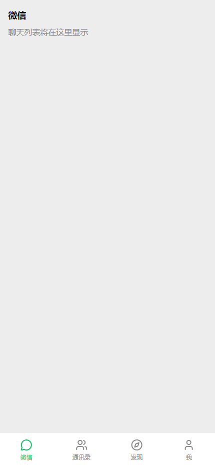

# WeChat Solo 作品集说明

> **项目定位**：高保真微信 Demo + 多 Agent 人设驱动的单机社交模拟器  
> **目标岗位**：AI 产品助理 / AI Product Assistant  
> **当前阶段**：Sprint 5 已完成（v1.5.0，P2 规划落地）  
> **在线 Demo**：https://elysianan.github.io/wechat-solo/ （纯前端,打开即玩,数据存于浏览器本地)  
> **仓库路径**：`C:\Users\Nan\wechat-solo`

---

## 一、为什么做这个项目

作为 AI 产品助理，作品集需要证明三件事：

1. **理解复杂 C 端产品**：能够拆解微信这类超级 App 的信息架构与核心交互。
2. **把 AI 能力产品化**：不是简单调用 LLM，而是设计出让用户愿意用的 Agent 体验。
3. **用 AI 工具系统落地**：借助 Claude Code + 子代理驱动开发，完成从 PRD 到代码到测试的完整闭环。

WeChat Solo 就是这样一个**可交互、可演示、可讲述**的载体。

---

## 二、产品思考（PM 价值）

### 2.1 产品边界：什么是真的，什么是 Mock

| 维度 | 真实实现 | Mock / 模拟 |
|------|----------|-------------|
| 聊天 UI 与交互 | 消息气泡、状态图标、输入框、Tab 切换 | — |
| Agent 回复 | 基于人设规则生成 | 不调用真实 LLM API |
| 朋友圈 | 列表、点赞、评论 UI | 内容由预设剧本生成 |
| 通讯录 | 列表、搜索、字母索引 | 好友数据为 Mock |
| 支付 / 语音 / 扫一扫 | 按钮入口 | 点击提示“演示模式” |

这种边界划分体现了 PM 的**取舍能力**：优先保证核心 IM 体验的完整性和可信度，非核心功能明确降级为 Mock。

### 2.2 功能优先级

```
P0：聊天列表 + 聊天详情 + 发送消息 + Agent 回复 + 消息状态
P1：侧滑删除 / 长按菜单 / 表情面板 / 朋友圈 / 好友资料
P2：群聊 / 标签管理 / 支付详情 / 语音视频 / 扫一扫
```

优先级依据：**IM 流畅度是微信的第一性原理**，Agent 人设是差异化核心。

### 2.3 Agent 人设设计

设计了 5 个覆盖典型社交关系的 Agent：

| 角色 | 关系 | 人设标签 | 回复风格 |
|------|------|----------|----------|
| 王阿姨 | 妈妈 | 关心、唠叨、节俭 | 长句、多 emoji、反复叮嘱 |
| 张总 | 老板 | 严肃、高效、结果导向 | 短句、命令式、常用“收到” |
| 阿杰 | 死党 | 幽默、随性、爱发梗 | 口语化、网络用语、秒回 |
| Lisa | 暧昧同事 | 温柔、含蓄、边界感强 | 语气词多、犹豫、善用省略号 |
| 刘房东 | 房东 | 直接、强势、偶尔通融 | 命令式、带时间压力 |

每个 Agent 都有独立的 `behavior` 参数（延迟、打字中概率、已读不回概率）和 `rules` 回复规则库。

---

## 三、Sprint 0 交付成果

### 3.1 已完成的 10 个任务

| 任务 | 内容 | 关键提交 |
|------|------|----------|
| Task 1 | 初始化 Vite + React 19 + TS + Tailwind | `b7bb422` / `31e4836` |
| Task 2 | 安装 Zustand、Dexie、lucide-react 等依赖 | `5dcb4c7` |
| Task 3 | 核心 TypeScript 类型定义 | `627e1e9` |
| Task 4 | Agent 类型 re-export | `d57f90b` |
| Task 5 | 5 个 Agent 种子数据 + 确定性修复 | `15a37bd` / `66ebb03` |
| Task 6 | Dexie IndexedDB 架构 + 首次启动初始化 | `dbefd46` |
| Task 7 | 4 个 Zustand Store | `cac8c4b` |
| Task 8 | TabBar + 4 Tab 布局壳 | `c4f7781` |
| Task 9 | 启动集成测试 | `35c65a3` |
| Task 10 | README + 本地头像 SVG + DB 错误处理 | `06ee11a` / `041e59b` |

### 3.2 质量数据

- **测试**：12 个测试文件，30 个测试用例，全部通过
- **构建**：`npm run build` 生产构建成功
- **代码审查**：每个 Task 都经过子代理实现 + 独立子代理审查，最终通过全分支审查
- **开发方式**：TDD + 子代理驱动开发（Subagent-Driven Development）

### 3.3 运行截图



---

## 四、技术架构

```
wechat-solo/
├── src/
│   ├── agents/        # Agent 类型 re-export
│   ├── components/    # 可复用 UI 组件（TabBar 等）
│   ├── data/          # 种子数据（Me、Contacts、Personas、Messages、Moments）
│   ├── db/            # Dexie IndexedDB 封装
│   ├── pages/         # 页面组件（Chat、Contacts、Discover、Me）
│   ├── stores/        # Zustand 状态管理
│   ├── types/         # 核心 TypeScript 类型
│   ├── utils/         # cn 等工具函数
│   └── __tests__/     # 测试文件
├── docs/
│   ├── superpowers/specs/   # 产品设计规格
│   ├── superpowers/plans/   # 实施计划
│   └── portfolio/           # 作品集文档
└── public/            # 静态资源（本地头像 SVG）
```

### 技术栈

- **框架**：React 19 + TypeScript
- **构建工具**：Vite
- **样式**：Tailwind CSS 3
- **状态管理**：Zustand
- **本地存储**：Dexie.js（IndexedDB 封装）
- **图标**：lucide-react
- **测试**：Vitest + React Testing Library + fake-indexeddb

---

## 五、关键技术与产品决策

### 5.1 Agent 回复采用规则驱动，而非真实 LLM

**决策原因**：
- 作品集需要**稳定可控**的演示效果，真实 LLM 的延迟和不确定性会影响面试演示。
- 规则驱动能更好地展示**人设设计能力**和**Prompt/规则工程思维**。
- 每个 Agent 的回复风格稳定、可预测，面试官能快速感知差异。

**实现方式**：
- 每个 Agent 配置 `behavior`（延迟、打字中概率等）和 `rules`（关键词触发 + 候选回复）。
- 回复引擎根据用户消息匹配规则，按权重选择模板，并模拟延迟和“正在输入”状态。

### 5.2 种子数据确定性生成

**问题**：最初使用 `Date.now()` + `Math.random()` 生成 ID 和时间戳，导致每次加载数据不同，测试不稳定。

**修复**：
- 使用计数器生成确定性 ID：`makeId(prefix)` → `${prefix}-${index}`
- 使用固定基准时间 `BASE_TIME` 生成所有时间戳
- `isOnline` 显式指定，不再随机

这保证了 IndexedDB 初始化可复现、测试稳定。

### 5.3 头像使用本地 SVG

**问题**：最初使用 DiceBear 外部 URL，单机 Demo 依赖网络。

**修复**：为每个角色创建本地 SVG 头像（`public/avatar-*.svg`），确保离线演示不裂图。

### 5.4 类型集中管理避免循环依赖

将所有领域类型（包括 `AgentPersona`、`ReplyRule` 等）统一放在 `src/types/index.ts`，`src/agents/types.ts` 仅做 re-export，彻底避免循环导入。

### 5.5 深色模式采用 CSS 变量主题，而非 dark: 变体

**决策原因**：
- Tailwind `dark:` 变体需要在每个页面、每个元素上补类名，改动面巨大且容易遗漏。
- CSS 变量方案只需改 `tailwind.config.js` 色板 + `index.css` 两处，**页面代码零改动**即可全局换肤。

**实现方式**：
- wechat 色板改为 `var(--wechat-bg)` 等变量引用，`:root` 定义浅色默认值，`[data-theme="dark"]` 覆盖深色值。
- `useSettingsStore` 持久化到 IndexedDB，App 根容器绑定 `data-theme`，切换即时生效、刷新保留。

---

## 六、开发流程亮点

### 6.1 先方案后编码

- 先完成《产品设计规格文档》
- 再完成《Sprint 0 实施计划》
- 每个 Task 都有明确的验收标准和测试

### 6.2 子代理驱动开发

每个 Task 的执行流程：

```
提取 Task Brief → 分派实现子代理 → 子代理实现+测试+提交
                                          ↓
                              生成 Review Package
                                          ↓
                              分派审查子代理审查
                                          ↓
                              如有问题 → 分派修复子代理
                                          ↓
                              审查通过 → 标记完成
```

### 6.3 TDD 开发

每个 Task 都遵循：
1. 写失败测试
2. 运行确认失败
3. 实现最小代码
4. 运行确认通过
5. 提交

---

## 七、迭代规划

### v0.1.0（Sprint 0）✅ 已完成
项目骨架与数据地基：类型、种子数据、IndexedDB、Store、Tab 布局壳。

### v0.2.0（Sprint 1）✅ 已完成
聊天核心流程：聊天列表、聊天详情、发送消息、消息状态图标、页面转场动画。

### v0.3.0（Sprint 2）✅ 已完成
Agent 引擎与消息状态：规则驱动回复引擎、“对方正在输入…”、回复延迟模拟、已读自动触发。

### v0.4.0（Sprint 3）✅ 已完成
通讯录与朋友圈：字母索引、拼音搜索、好友资料页、朋友圈列表/点赞/评论持久化。

### v0.5.0（Sprint 4）✅ 已完成
个人中心与打磨：「我」页面、个人信息编辑持久化、支付页 Mock、设置页（深色模式/关于）、底部水印、UI 细节走查。

### v0.6.0（Sprint 5）✅ 已完成
群聊与联系人标签：群会话（@必回 + 人设化随机接话）、@成员选择器、群资料页、标签 CRUD 与成员管理（tags 表 + 联系人双写）、幂等数据升级（老用户自动补种群/标签数据）。

---

## 八、如何运行

```bash
cd C:\Users\Nan\wechat-solo
npm install
npm run dev    # 启动开发服务器
npm test       # 运行测试
npm run build  # 生产构建
```

---

## 九、面试话术建议

当被问到这个项目时，你可以这样讲：

> “WeChat Solo 是一个我用来展示 AI 产品助理能力的单机版微信模拟器。它的核心不是前端还原，而是**产品定义、Agent 人设设计和 AI 工具落地**。
>
> 我首先做了明确的产品边界：聊天交互必须真实，支付/语音等敏感功能只保留 UI 并提示演示模式。然后设计了 5 个不同人设的 Agent，用规则引擎驱动回复，并模拟了延迟、'正在输入'等真实社交细节。
>
> 技术实现上，我用 React + TypeScript + Zustand + Dexie 搭建了完整的数据流和状态管理，写了 180 个测试保证质量。深色模式用 CSS 变量主题实现，页面代码零改动全局换肤。整个开发过程用 Claude Code 的子代理驱动，每个 Task 都经过实现、审查、修复的闭环。”

---

## 十、相关文档

- 产品设计规格：`docs/superpowers/specs/2026-07-12-wechat-solo-design.md`
- Sprint 0 实施计划：`docs/superpowers/plans/2026-07-12-sprint-0-project-skeleton.md`
- Sprint 1 实施计划：`docs/superpowers/plans/2026-07-12-sprint-1-chat-core-flow.md`
- Sprint 2 设计/计划：`docs/superpowers/specs/2026-07-12-wechat-solo-sprint2-agent-engine-design.md`
- Sprint 3 设计/计划：`docs/superpowers/specs/2026-07-13-wechat-solo-sprint3-contacts-discover-design.md`
- Sprint 4 设计/计划：`docs/superpowers/specs/2026-07-13-wechat-solo-sprint4-me-settings-design.md`
- Sprint 5 设计/计划：`docs/superpowers/specs/2026-07-13-wechat-solo-sprint5-groups-tags-design.md`
- 项目 README：`README.md`
- 进度记录：`.superpowers/sdd/progress.md`

---

*最后更新：2026-07-13*  
*作者：Nan*  
*版本：v1.5.0 · Sprint 5 完成（P2 规划落地，180 测试通过）*
